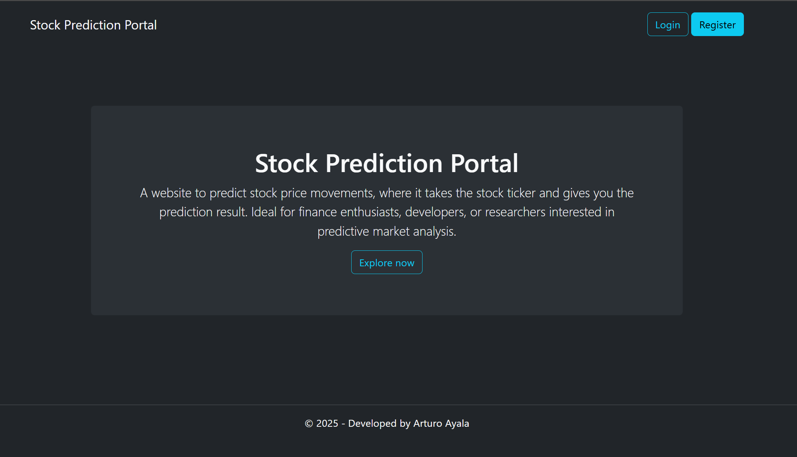
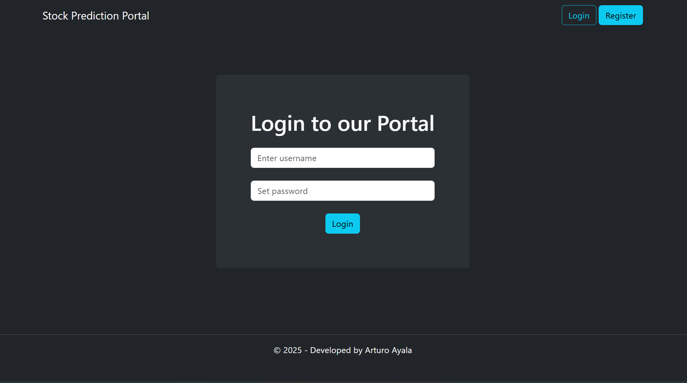
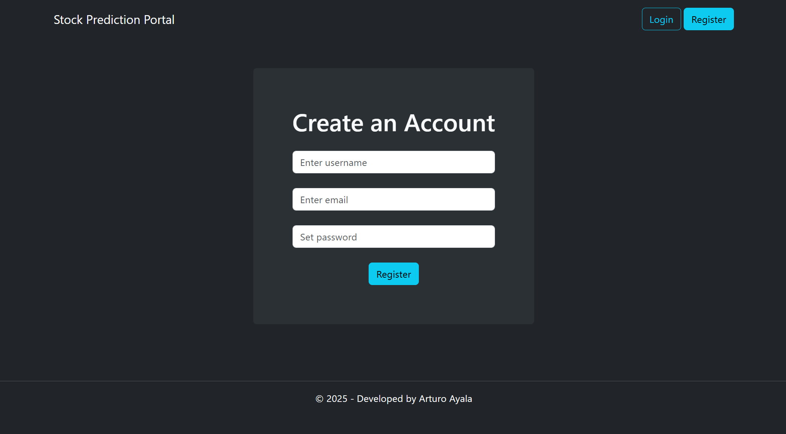
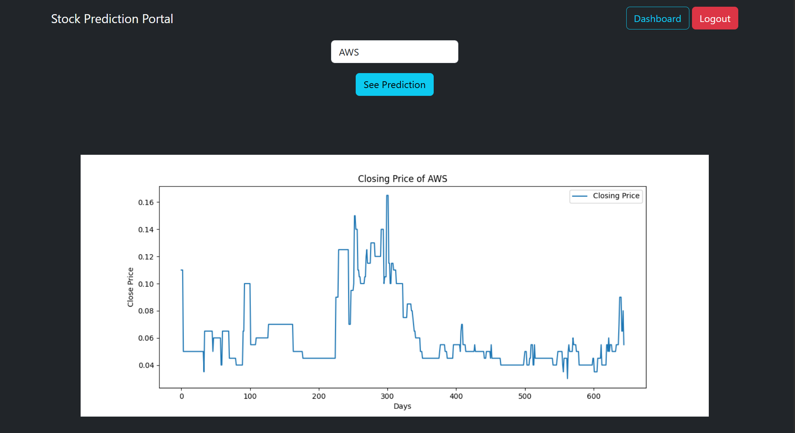
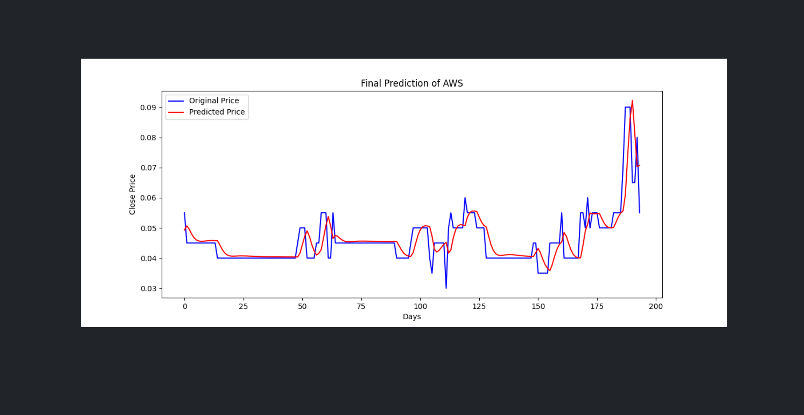
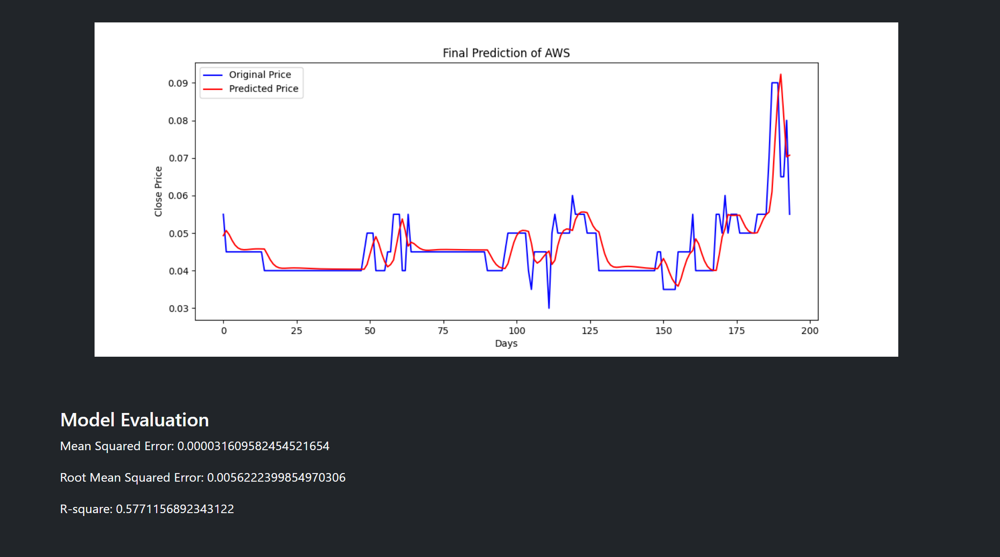

# 📈 stock-prediction-website

A website to predict stock price movements, where it takes the stock ticker and gives you the prediction result. Ideal for finance enthusiasts, developers, or researchers interested in predictive market analysis.

---
### 🚀 Site Features
- 🔐 User authentication system (registration and login)
- 📊 Stock prediction using LSTM neural networks
- 📈 Visualization of graphs
- ⚙️ RESTful APIs for frontend/backend communication
  
---
### 🛠️ Technologies used
Some of the project tools are:
| Stack | Technology |
|-------|------------|
| Backend | Django + Django REST Framework (Containerized with Docker) |
| Frontend | React.js (interactive interface + authentication system) in Docker containers |
| Machine Learning | Python, LSTM (Long Short-Term Memory) |
| Database | SQLite or PostgreSQL (according to deployment) |

---
### 📄 License
This project is licensed under [MIT License](LICENSE).
You are free to use, modify, and distribute it, as long as you include a copy of the original license.

---
## 📸 Capturas de pantalla
  
  
 

---
### ✍️ Author
Developed by Arturo Ayala –
Personal project for educational and experimental purposes in the field of financial analysis and machine learning.
GitHub: https://github.com/ArturoAyala99

